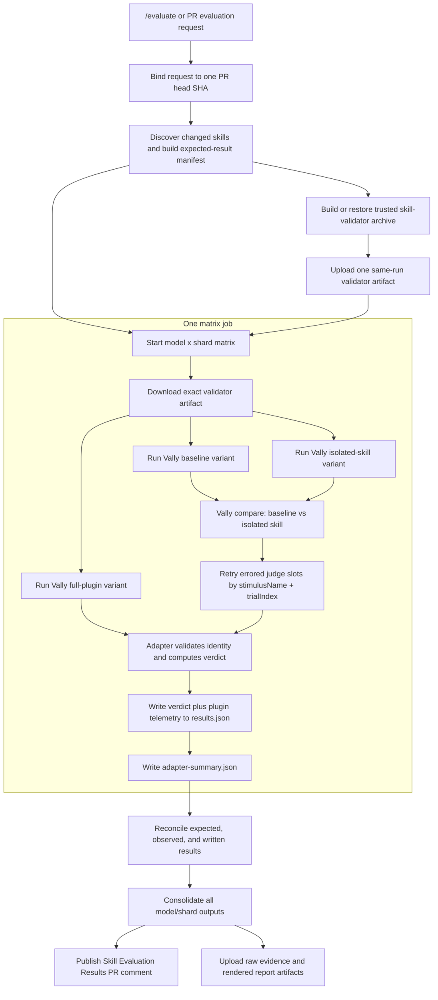
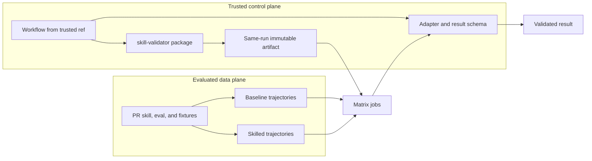
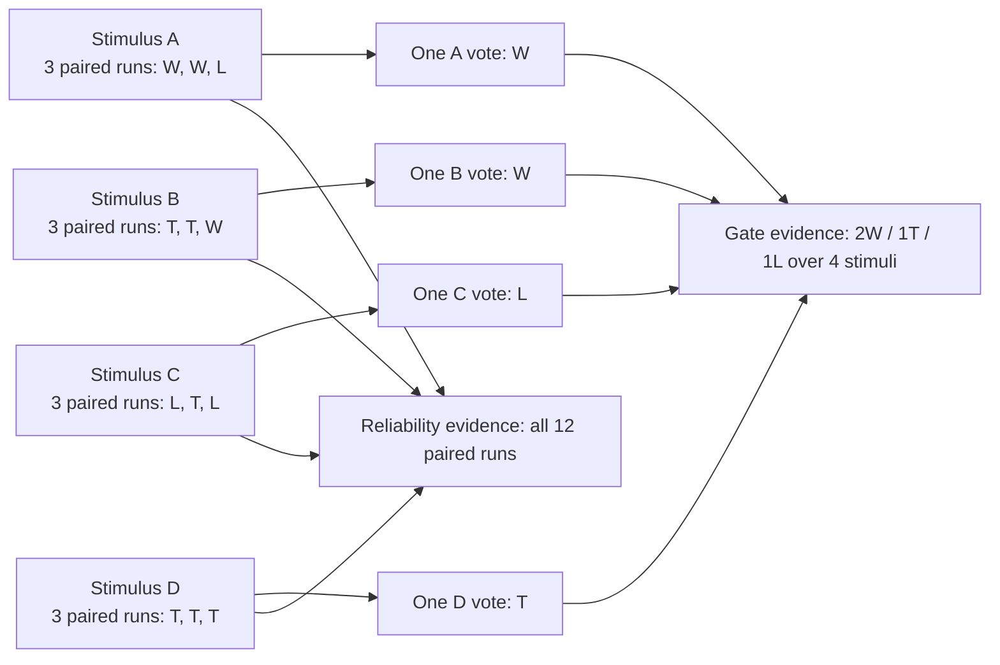
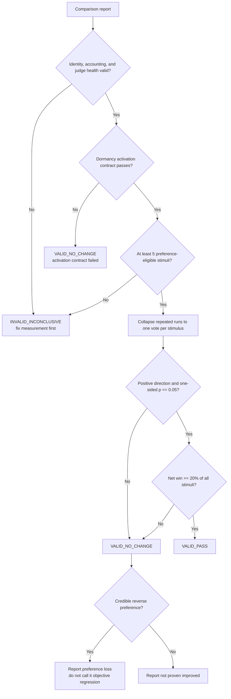
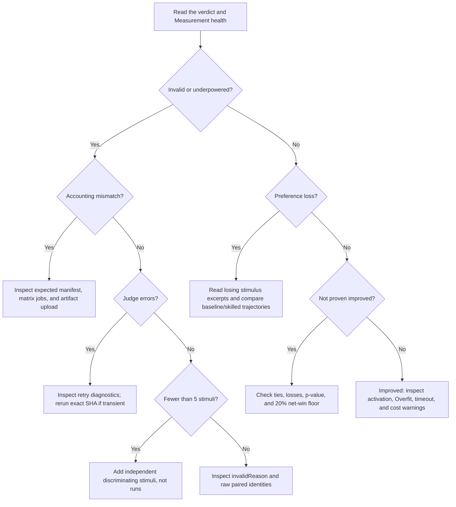

# Skill evaluation infrastructure

This document explains how this repository evaluates skills, how it builds on
[Vally](https://microsoft.github.io/vally/), which measurements affect a
verdict, and how to repair common failures.

Use these focused references when you need more detail:

- [Investigating evaluation results](./InvestigatingResults.md) explains every
  result field and provides artifact investigation scripts.
- [Eval authoring quality](../eval-quality/README.md) explains the structural
  defects that the authoring gate detects.
- [CONTRIBUTING.md](../../CONTRIBUTING.md#evaluating-your-skill) explains how to
  create an eval and run `/evaluate`.

## Why this layer exists

Vally provides the evaluation engine. It runs test cases, records agent
trajectories, applies graders, repeats trials, and compares two experiment
arms. The repository adds the policy needed to answer a different question:

> Is this result complete, independent, and strong enough to make a merge
> decision?

A high score is not enough. An eval can look decisive while it is
underpowered, repeats one task many times, loses results, or contains
comparison-judge failures. The repository therefore validates the instrument
before it evaluates the skill.

## How the repository builds on Vally

The design follows these official Vally concepts:

- [How it works](https://microsoft.github.io/vally/concepts/how-it-works/):
  eval spec -> agent run -> trajectory -> graders -> metrics.
- [Scoring](https://microsoft.github.io/vally/concepts/scoring/): scores,
  pass rates, repeated-trial reliability, and confidence intervals.
- [`vally compare`](https://microsoft.github.io/vally/reference/cli/compare/):
  paired baseline and treatment comparison.
- [Grader taxonomy](https://microsoft.github.io/vally/concepts/grader-taxonomy/):
  static, agent, and other grader classes have different trust properties.

| Responsibility | Vally | Repository policy |
| --- | --- | --- |
| Define a test case | `stimuli` in `eval.yaml` | Require unique names, valid fixtures, and at least five preference-eligible distinct stimuli for new gated evals; keep explicit dormancy as activation-contract evidence |
| Repeat a test | `defaults.runs` | Treat repeats as reliability evidence, not new independent task breadth |
| Run the agent | Copilot SDK executor | Run baseline, isolated-skill, and full-plugin variants at one exact commit |
| Grade output | Static and LLM graders | Preserve grader evidence, but do not treat a mixed aggregate as objective completion |
| Compare arms | Paired comparison judge | Check stable slot identity and retry only failed comparison slots |
| Report scores | Scores, confidence intervals, pass metrics | Use scores for diagnosis, not as the improvement gate |
| Decide improvement | Comparison report | Collapse repeats to one vote per preference-eligible stimulus, apply an exact sign test, require a practical net win, and require explicit dormancy contracts to pass |
| Handle failures | Error fields and process status | Reconcile expected, observed, and written results; fail closed on any mismatch |
| Publish results | Raw Vally artifacts | Emit schema-versioned results, one consolidated PR report, and repair actions |

This extra policy addresses three different risks:

1. **Instrument validity:** Did the intended tests run, and can every output be
   matched to the intended input?
2. **Statistical validity:** Does the result contain enough independent task
   evidence to support the claim?
3. **Operational validity:** Are judge failures, missing files, and workflow
   faults separated from skill behavior?

## End-to-end architecture



The implementation is split across these main components:

| Component | Purpose |
| --- | --- |
| [`.github/workflows/evaluation.yml`](../../.github/workflows/evaluation.yml) | Authorizes a request, binds it to an exact commit, discovers work, starts the reusable workflow, consolidates results, and publishes the PR comment |
| [`.github/workflows/evaluation-run.yml`](../../.github/workflows/evaluation-run.yml) | Builds the trusted validator artifact, runs the model/shard matrix, invokes Vally, applies fault injection in tests, and uploads artifacts |
| [`adapt.mjs`](./adapt.mjs) | Validates Vally comparison data, retries failed judge slots, computes schema-version-4 evidence, and assigns repository verdicts |
| [`consolidate.mjs`](./consolidate.mjs) | Combines model/shard result sets and produces the decision-first PR comment |
| [`check_eval_quality.py`](../eval-quality/check_eval_quality.py) | Blocks structurally invalid or newly underpowered eval instruments before they run |

## Trust boundaries

Evaluation can execute content from the commit being tested. The workflow must
not let that content replace the validator that decides whether the result is
valid.



The same-run artifact is important. A previous issue-comment run could not save
its validator cache. Each matrix job then attempted its own fallback build,
which required access to a restricted feed. One cache permission fault became a
matrix-wide infrastructure failure. The current design produces one archive
before evaluated content is used, then every matrix job downloads that exact
archive.

## Execution lifecycle

### 1. Bind the request to an exact commit

The request records the PR head SHA. Discovery, execution, result collection,
and the final report all use that identity. If the PR moves, the old run is not
reported as evidence for the new commit.

### 2. Discover the matrix and declare expected outputs

Discovery finds affected skills and creates the model/shard matrix. The workflow
also writes an expected-result manifest before execution. This allows the
collector to distinguish:

- a result that was expected and written;
- a result that was expected but missing;
- a result that appeared without being expected;
- a duplicate result;
- a malformed or invalid result.

The run fails closed unless expected, observed, and written identities match
exactly and no measurement-invalid result remains. Missing execution arms,
unreadable eval specs, unresolved judge or pairing errors, malformed reports,
and unknown invalid states fail the matrix leg after diagnostic artifacts are
written. An unreadable spec is invalid because the adapter cannot safely infer
whether `expect_activation: false` dormancy contracts apply. The explicit
`underpowered` eval-design state remains visible as instrument debt but does not
become an infrastructure failure. This proof applies inside each matrix leg.
Discovery omits entries with no eval specs. The PR collector separately requires
the full reusable matrix to succeed and requires one downloaded
`adapter-summary.json` per declared matrix entry before it renders any verdict.
Partial artifacts remain available for diagnosis, but they are labeled
incomplete and are never consolidated into quality evidence. A leg that found
evals also fails if its primary result artifact is missing.

### 3. Run three Vally variants

- **Baseline:** the tested skill is unavailable.
- **Skilled:** only the tested skill is available.
- **Plugin:** the full plugin is available, which can expose routing conflicts
  and interactions with sibling skills.

The paired preference gate compares baseline only to the isolated-skill
variant. The plugin variant contributes absolute activation and quality
telemetry. It can expose routing conflicts and sibling-skill interference, but
it does not receive a separate sign-test or practical-effect verdict.

### 4. Preserve raw Vally evidence

Each Vally run produces trajectories, grader output, metrics, and trial
metadata. The adapter keeps the raw report available for diagnosis. It does not
replace Vally's evidence; it adds repository-specific validity and decision
fields.

### 5. Retry transient executor timeouts once

If a required baseline or isolated-skilled trial fails with
`Timeout after ... waiting for session.idle`, the workflow reruns only that eval
and variant once. The recovery step merges only successful records with matching
stable `shardKey` values after normalizing each eval path. A record without a
`shardKey` fails closed instead of using another field as an unproven identity.
The recovery never replaces successful first-attempt records. A persistent
timeout or a different executor error stays in the original JSONL and remains
measurement-invalid. The optional whole-plugin telemetry arm is not retried and
remains outside the baseline-versus-skilled measurement gate.

The retry is limited to three affected eval/variant groups per matrix leg. More
groups indicate a systemic failure, so the workflow skips recovery and fails
closed instead of multiplying load. `executor-retry-summary.json` and each
recovered record's `executorRetry` field retain the attempt evidence. Recovered
records keep the original experiment provenance required by `vally compare`;
the retry run ID is recorded separately as `executorRetry.retryRunId`.

### 6. Retry only failed comparison-judge slots

The paired identity is `(stimulusName, trialIndex)`. If a comparison judge
times out or its organization is disabled, the adapter builds a retry report
for only the errored slots. Successful first-attempt judgments are not rerun.
The merged report keeps retry diagnostics even when no slot recovers.

Retry is bounded to one additional attempt. Remaining judge errors make the
result invalid. They are not counted as skill losses.

### 7. Separate preference stimuli from activation contracts

`expect_activation: false` declares an off-target case where the isolated
target skill must stay dormant. Correct dormancy makes the skilled arm
behaviorally equivalent to baseline, so its head-to-head preference is a tie or
judge noise by construction. Schema version 4 therefore retains the comparison
under `excludedScenarioEvidence` and `scenarios[]`, but excludes it from the
sign test and net win.

The same scenario becomes an isolated-arm activation contract. Unexpected
target-skill activation blocks a pass with
`stateReason.code = activation_contract_failed`. Plugin-arm activity remains
diagnostic because the plugin event does not identify which sibling skill
activated. Comparison errors, pairing errors, and completion transitions still
account for every stimulus, including dormancy, so exclusion cannot hide a
broken measurement or completion signal.

Dormancy annotations that match no observed stimulus are retained in
`activationContract.unmatchedDormancyStimuli` and emitted as adapter warnings.
They do not change the current pass rule, but make renames, typos, and missing
scenario evidence visible instead of silently dropping the contract.

### 8. Convert repeated trials into independent stimulus votes

Repeated runs answer "does this task behave consistently?" They do not answer
"does this work on more kinds of tasks?" The adapter therefore gives each
distinct stimulus one gate vote:



This prevents a four-task eval with three repetitions from pretending to have
twelve independent test cases.

### 9. Apply the repository decision rule

For one model and skill's baseline-versus-isolated comparison:

1. Require complete and well-formed result identity.
2. Require every explicit dormancy activation contract to pass. This objective
   routing result remains definitive even when preference is underpowered.
3. Require at least five preference-eligible distinct stimuli.
4. Collapse repeated runs to one W/T/L direction per preference-eligible stimulus.
5. Remove ties for the exact one-sided sign test.
6. Require `p <= 0.05`.
7. Require positive aggregate direction.
8. Require `(wins - losses) / preference-eligible stimuli >= 0.20`.

The statistical test and practical floor answer different questions:

- The sign test asks whether the observed direction is unlikely under an even
  win/loss process.
- The practical floor asks whether the gain is large enough across the task
  surface to matter.

Example: `5W / 95T / 0L` has `p = 0.03125`, but its net win is only 5%. It is
statistically significant and practically sparse, so it does not pass.

The 20% floor does not make small or niche instruments harder to pass. For
every instrument from 5 through 25 stimuli, any record that can pass the exact
sign test already has a net win of at least 20%. The first record changed by the
floor is `5W / 21T / 0L` at 26 stimuli: `p = 0.03125`, but net win is only
`5 / 26 = 19.2%`. `adapt.test.mjs` exhaustively checks this boundary.

Per-eval overrides are intentionally unsupported. An override would matter
only for a larger instrument with a statistically credible but sparse effect,
which is the exact false-positive class the floor prevents. It would also let
authors tune a threshold after seeing results. If repository evidence later
shows that 20% is wrong, change the versioned repository policy with a
predeclared rationale and apply it consistently; do not create result-specific
exceptions.



`VALID_REGRESSION` is reserved. It will require a trusted mapping from an
explicit deterministic grader declaration in the eval spec to that grader's
result in both arms. Vally 0.13 raw results do not provide that stable
spec-to-result identity. The current aggregate pass signal can mix static and
LLM graders, so it cannot safely prove objective completion regression.

## Verdicts shown on pull requests

| State | PR label | Meaning | Merge effect |
| --- | --- | --- | --- |
| `VALID_PASS` | Improved | Complete, adequately powered, statistically significant, at least a 20% task-level net win, and all explicit dormancy contracts passed | Passes the result |
| `VALID_NO_CHANGE` with `activation_contract_failed` | Activation contract failed | Preference evidence may be positive, but the isolated target skill activated on an explicit dormancy case | Blocks a pass and reports the routing defect |
| `VALID_NO_CHANGE` | Not proven improved | Measurement is valid, but improvement did not satisfy the full decision rule | Does not claim improvement |
| `VALID_NO_CHANGE` with reverse preference | Preference loss, report-only | The comparison judge credibly preferred baseline | Diagnostic only; it is not objective completion proof |
| `INVALID_INCONCLUSIVE` | Invalid or underpowered | Result identity, accounting, judge health, or task breadth is not trustworthy | Fails closed; repair or rerun |
| `VALID_REGRESSION` | Objective regression | Reserved for a future deterministic completion gate | Not emitted today |

The PR report keeps **Overfit** separate from the verdict. A result can improve
and still be too tailored to known eval wording. A result can also have low
overfit and fail because it did not improve.

## Metrics that matter

Read the metrics in layers. Do not interpret effect metrics until the
measurement-health layer is valid.

### Measurement and instrument validity

| Metric | What it answers | Example | Required action |
| --- | --- | --- | --- |
| Expected / observed / written | Did every planned result appear exactly once and get persisted? | Final exact-commit run `32232320378`: `8 / 8 / 8` | Any mismatch is invalid. Inspect discovery, matrix status, upload, and aggregation. |
| Missing / unexpected / duplicate | Is result identity complete and unique? | Expected skill A, received skill B, or received skill A twice | Fix manifest or result routing. Do not infer quality from the partial set. |
| Invalid result count | Did any adapter result fail schema, evidence, or task-breadth checks? | One report has no paired trials, or an eval is underpowered | Inspect `stateReason` and raw artifacts. |
| Measurement-invalid eval count | Did execution, judge, pairing, or adapter failure make any result untrustworthy? | The skilled arm produced no records | Must be zero. The matrix leg fails after it preserves diagnostics. Explicit `underpowered` design debt is excluded. |
| Stable paired slot identity | Can baseline and skilled evidence be paired without guessing? | `(prompt-a, 0)` exists once in both arms | Fix missing, negative, or duplicate `trialIndex` values before comparing. |
| Comparison judge errors | Did the judge fail independently of the skill? | `session.idle` or disabled organization | Retry the exact slot once; invalidate if it remains errored. |
| Retry recovery | Did the targeted retry repair failed slots? | `1 attempted / 1 recovered / 0 unresolved` | If unresolved is nonzero, inspect judge diagnostics; do not count it as a loss. |
| Distinct stimulus names | Can one task identity be matched across arms? | Two stimuli both named `Generate tests` | Rename them uniquely. Duplicate names are an authoring error. |
| Fixture integrity | Did both arms receive the same intended input? | Cobertura attributes say 50%, payload says 80% | Repair the fixture and any prompt/rubric claims that quote it. |

### Improvement evidence

| Metric | What it answers | Example | Interpretation |
| --- | --- | --- | --- |
| Preference-eligible stimuli | How many independent in-scope task cases vote in the gate? | 4 in-scope stimuli + 1 dormancy contract = 4 votes, not 5 | Fewer than five preference cases cannot pass the exact 5% test. |
| Stimulus W/T/L | On how many tasks did skilled beat, tie, or lose to baseline? | `5W / 1T / 1L` | This is the primary task-level effect summary. |
| Discordant votes | How many stimulus votes were wins or losses? | `5W / 95T / 0L` has 5 discordant votes | Ties do not enter the sign-test numerator or denominator. |
| One-sided exact p-value | Is the positive W/L direction unlikely under a 50/50 null? | `5W / 0L` gives `p = 0.03125` | Applies to one model/skill result. It is not corrected across the full matrix. |
| Aggregate net win | Is the improvement broad enough across all stimuli? | `(5 - 0) / 100 = 5%` | Must be at least 20% to pass, even when the p-value passes. |
| Mean score and confidence interval | Did absolute grader scores move, and how uncertain is the mean? | Both arms can score highly while the paired preference is inconclusive | Triage only. It is not the pass statistic. |
| Model identity | Which executor model produced the trajectories? | Claude Sonnet and GPT can disagree | Never pool different executor models into one vote. |
| Judge identity | Which comparison model made the preference decision? | Cross-family executor/judge combinations | Treat correlated combinations as sensitivity evidence, not independent task breadth. |

The five-stimulus floor is repository policy, not a Vally recommendation.
Four all-win discordant votes give `0.5^4 = 0.0625`, which cannot meet
`alpha = 0.05`. Five all-win votes give `0.5^5 = 0.03125`, so five is the
smallest eligible sample. It is an eligibility floor, not a power target. At
exactly five stimuli, one tie or one loss prevents a pass.

### Reliability, behavior, and resource diagnostics

| Metric | What it answers | Example | How to use it |
| --- | --- | --- | --- |
| Repeated-run W/T/L | Does the comparison direction repeat within one task? | One stimulus produces `W, W, L` | Investigate instability, but keep one task-level vote. |
| Vally pass rate | How often did the arm satisfy its graders? | 4 of 5 repeated runs pass | Diagnose absolute reliability. Do not substitute it for paired improvement. |
| Vally pass@k | Is at least one of `k` attempts likely to pass? | Useful when retry is part of product behavior | Use only when "one success is enough" matches the user experience. |
| Vally pass^k | Are all `k` attempts likely to pass? | Useful for strict repeatability | Prefer this view when every invocation must work. |
| Activation | Did the skill load when it should and stay dormant when it should not? | `6 / 9` isolated activation | Fix routing text, prompt realism, or dormancy cases. |
| Dormancy contract | Did the isolated target skill stay inactive on every explicit off-target case? | `2 satisfied / 1 violated` | A violation blocks a pass; the scenario's preference remains report-only. |
| Timeouts | Did the skill complete within the configured limit? | Skilled arm times out while baseline completes | Inspect excessive tool calls or scope. Raise timeout only for legitimate work. |
| Error count | Did the executor, tool, grader, or harness fail? | Missing dependency in one fixture | Classify the source before editing skill guidance. |
| Overfit | Does the skill appear tailored to eval wording or fixture details? | High improvement with `Overfit = 0.57` | Generalize the skill and test with unseen prompts. It is not a statistical gate. |
| Tokens, turns, and wall time | What resource cost did the skill add? | Same quality with 2x wall time | Use as optimization evidence after correctness is established. |
| Tool behavior | Did the skill use expected tools and avoid unsafe ones? | A research skill answers without opening its required source | Add deterministic tool-use graders where possible. |
| Objective completion transitions | Did deterministic completion move baseline-only, skilled-only, both, or neither? | `baselineOnly = 1` | Telemetry only until grader identity is trustworthy. |

## Real failures and what fixed them

### Repeated runs manufactured a false sample size

[Issue #986](https://github.com/dotnet/skills/issues/986) showed the core
independence failure. Four stimuli with three runs could be reported as
`12W / 0L`. If all twelve were treated as independent, the p-value looked
decisive. The true task record was only `4W / 0L`, with
`p = 0.0625`.

**Fix:** keep all twelve paired outcomes for reliability, but give the gate only
four stimulus votes. Mark the eval underpowered.

**Do not fix it by:** increasing `runs`. Add independent task cases that cover
new decisions, inputs, or failure modes.

### A statistically significant result had little practical coverage

[Issue #970](https://github.com/dotnet/skills/issues/970) identified the
`5W / 95T / 0L` case. The exact sign test passes because all five discordant
votes are wins. The change affects only 5% of the task surface.

**Fix:** require a 20% net win over all distinct stimuli in addition to
statistical significance.

**Why 20%:** it is a repository policy for a practically visible task-level
effect, not a Vally default. It blocks sparse wins while allowing ordinary
small evals to pass when their evidence is broad. The full reachable result
space through the repository's current 24-trial maximum was enumerated when the
rule was added.

### Judge outages looked like skill reliability failures

[Issue #909](https://github.com/dotnet/skills/issues/909) tracks run
[`29228914412`](https://github.com/dotnet/skills/actions/runs/29228914412),
which contained 11 errored comparison trials across eight skills. The errors
were `session.idle` timeouts and disabled organizations in the comparison
judge, not fixture or skill failures.

**Fix:** classify judge failures separately, retry only their stable slots, and
invalidate any result with unresolved comparison errors.

**Do not fix it by:** changing the skill, weakening its rubric, or counting the
judge errors as losses.

### Eval YAML parsed but enforced the wrong test

Historical authoring defects included:

- duplicate YAML keys that silently overwrote a stimulus prompt or rubric;
- an empty grader `config` block that parsed but enforced nothing;
- both deprecated `config:` and `defaults:` in one spec, which Vally rejects;
- untracked fixture files that existed locally but not in CI;
- Cobertura summary attributes that contradicted their line payload;
- a dormancy guard with `reject_skills: ["*"]`, which made the skilled arm
  equivalent to baseline;
- duplicate stimulus names, which made comparison identity ambiguous.

**Fix:** run the authoring gate before dispatch. It blocks eleven structural
defect classes and checks the underpowered-eval debt ledger. See
[Eval authoring quality](../eval-quality/README.md) for each pattern and repair.

### A cache fault became a matrix-wide validator failure

An issue-comment run could not save the validator cache. Every matrix job then
attempted a restricted-feed build and failed for a reason unrelated to the
tested skills.

**Fix:** produce or restore one validator archive in a trusted job, upload it
as a same-run artifact, and require every matrix job to use that artifact.

## Troubleshooting from the PR report



| PR symptom | First evidence to inspect | Common repair |
| --- | --- | --- |
| Missing or unexpected result | Measurement health counts and matrix job list | Fix discovery identity, failed job, or artifact path |
| Invalid comparison | `invalidReason`, comparison errors, retry summary | Repair slot identity or rerun a transient judge failure |
| Underpowered | Distinct stimuli and power note | Add independent, discriminating stimuli |
| Many ties | Weak scenarios and evidence excerpts | Make tasks expose behavior the skill is meant to change |
| Preference loss | Losing stimulus excerpts and trajectories | Fix the skill behavior; do not infer objective regression |
| Low activation | Baseline/skilled/plugin activation table | Improve skill description and realistic trigger prompts |
| High Overfit | Overfit column and grader evidence | Remove fixture-specific instructions and test unseen inputs |
| Timeout or high cost | Trial diagnostics, turns, tools, and duration | Reduce unnecessary exploration or narrow the skill workflow |
| Objective completion concern | Deterministic grader evidence in both raw arms | Investigate manually; the hard gate is intentionally reserved |

The compact PR comment includes only non-passing or warning-bearing detail.
Download the artifacts when you need every passing scenario or full trajectory.

## Investigation workflow

1. Confirm that the report commit matches the PR head commit you intend to
   evaluate.
2. Read **Measurement health** before quality metrics.
3. Identify the affected model, skill, and isolated/plugin comparison.
4. Use weak-scenario excerpts to find the first failing stimulus.
5. Download `results.json`, `adapter-summary.json`, and raw Vally experiment
   files for that matrix leg.
6. Follow [Investigating evaluation results](./InvestigatingResults.md) to
   inspect schema fields, paired slots, errors, and trajectories.
7. Rerun the exact same SHA only when the evidence shows a transient
   infrastructure or judge failure.

Do not rerun until a noisy result turns green. Repeated optional stopping
inflates false-positive risk. A skill change should produce a new commit and a
new exact-commit evaluation.

## Authoring and local validation

Create or edit evals according to
[CONTRIBUTING.md](../../CONTRIBUTING.md#evaluating-your-skill). Use
`defaults:` for new specs. `config:` remains a deprecated Vally alias only for
existing specs; declaring both is invalid.

Run the structural quality checks before evaluation:

```powershell
python eng\eval-quality\check_eval_quality.py
python eng\eval-quality\selftest_eval_quality.py
```

Run adapter and report tests after changing result policy:

```powershell
node --test eng\vally-adapter\adapt.test.mjs eng\vally-adapter\consolidate.test.mjs
```

The adapter tests include fault-injection paths for judge timeouts, disabled
organizations, partial retry recovery, missing and unexpected results, and an
entirely invalid run. The consolidation tests cover the PR and full-results
rendering contracts.

When a workflow file changes, also run `actionlint` because valid YAML is not
proof of a valid GitHub Actions workflow.

## Current limitations and debt

As of the eval-correctness rollout in August 2026:

- 48 existing evals remain grandfathered below the five-stimulus floor. Their
  results are underpowered and cannot pass or fail the gate.
- 25 evals have only five to seven stimuli. They are eligible, but one loss is
  fatal and ties can leave too few discordant votes.
- Unique stimulus names do not prove semantic independence. Eval authors must
  not satisfy the floor with trivial prompt rewrites that test the same task.
- No matrix-wide multiple-comparison correction is applied. Every p-value
  describes one model/skill/comparison result.
- Executor/judge combinations are sensitivity views. They are not independent
  task replications.
- Position swapping reduces comparison-judge order bias, but it cannot remove
  every judge preference for output length, formatting, or style.
- Result reconciliation proves completeness against the discovery manifest. It
  cannot prove that discovery selected every skill that is semantically
  affected by a change.
- Objective completion transitions are telemetry only because Vally 0.13 does
  not expose trusted spec-to-result grader identity.
- Coverage management still needs explicit suite or tag policy. Adding more
  trials does not by itself improve task coverage.

Keep debt repair separate from correctness-policy changes. First make the
measurement honest; then improve the affected eval instruments in focused
changes.

## Policy summary

1. **Validate before interpreting.** Missing, duplicate, malformed, or errored
   evidence fails closed.
2. **Count tasks, not repetitions.** Distinct stimuli are the inference unit;
   repeated runs measure reliability.
3. **Require statistical and practical evidence.** A pass needs `p <= 0.05`
   and at least a 20% net win over all stimuli.
4. **Separate preference from completion.** LLM comparison losses are
   diagnostic; deterministic objective regressions need stronger identity.
5. **Preserve exact identity.** Commit, model, skill, variant, stimulus, and
   trial index must remain traceable from request through report.
6. **Fix the correct layer.** Repair judge and workflow faults as measurement
   faults; repair skill behavior only when valid evidence shows a skill issue.
